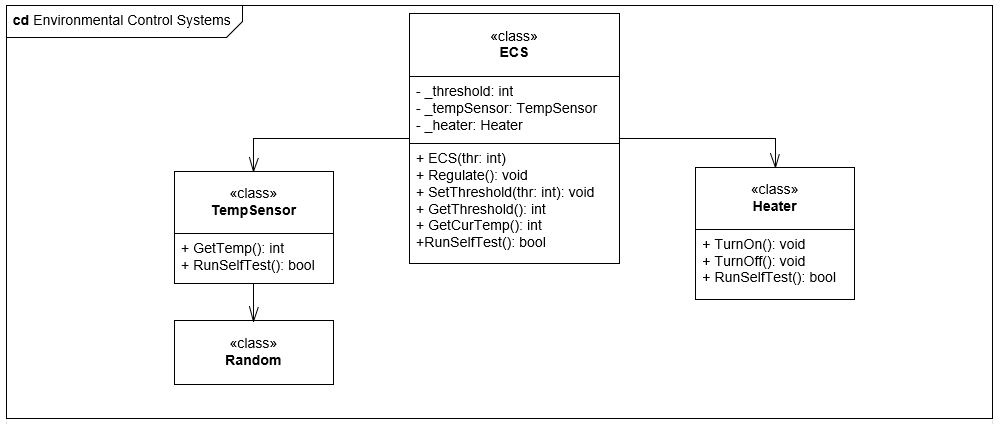
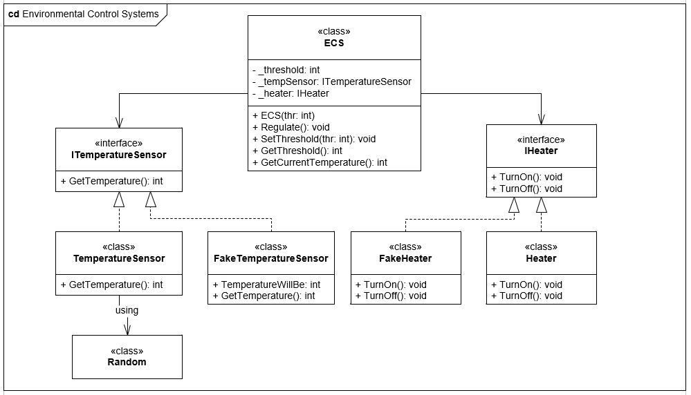

# ECSDesignForTestability
Lektion 3.1 SWT-F19

## Table of contents

1. [Requirements](#req)
2. [Exercises](#ex)
    1. [Infrastructure](#infra)
    2. [Reverse Engineering](#reverse)
    3. [Design Refactoring](#design)
3. [Tasks](#task)

## Requirements 

## Exercises 

### Infrastructure 

### Reverse Engineering 

### Design Refactoring 

#### Identify
#### Interface
#### Inject

## Tasks

- [X] 3.1 Create a design that, for each of the flaws you identified before, proposes a solution. Apply the techniques discussed in class to make the design more testable.

- [ ] 3.2 Implement your refactored design, in a new application project, under the same solution. Commit and push the changes.

- [ ] 3.3 Pull the changes. Then, create unit tests for the refactored version of the class ECS, in a new test class library project.

- [ ] 3.4 Set up a Jenkins project on the CI server for your solution and ensure it runs your unit test on your
project.

- [ ] 4.1 Add a window to the ECS. The window should open when the temperature rises
above a certain upper temperature threshold (different from the heating threshold) and close if
the temperature is below this threshold. Of course, it doesn't make sense, if the heater can be on
and the window open at the same time.

- [ ] 4.2 Extend the threshold mechanism to be configurable so that they can be changed at
run-time, and it must be checked that they are consistent, when set.
